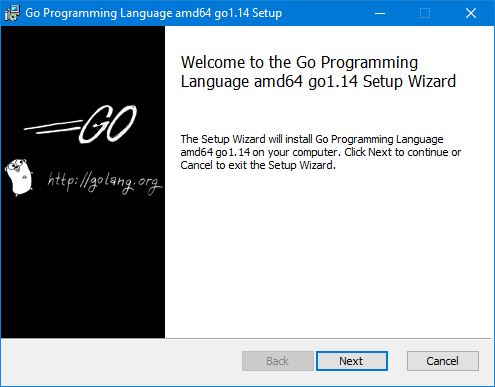
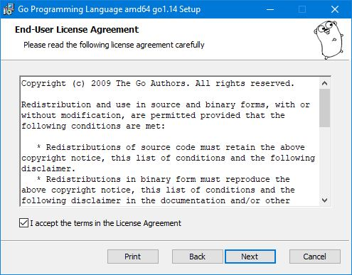
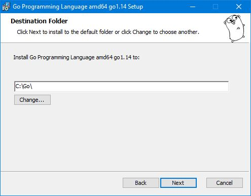
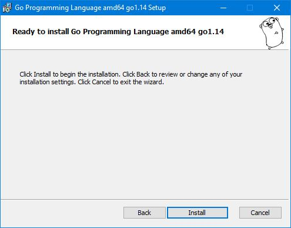
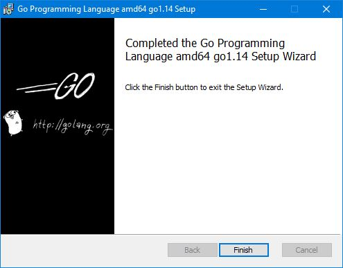
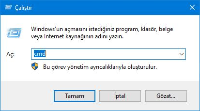
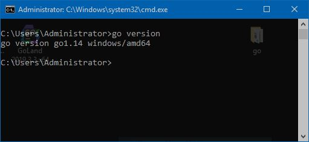

# Go Derleyicisinin Kurulumu

Golang'in çalışabilmesi için öncelikle derleyicinin kurulması gerekiyor. Yazdığınız Go kodlarının çalıştırılabilmesi için bu derleyici gerekiyor.

[**https://golang.org/dl/**](https://golang.org/dl/) adresinden işletim sisteminize uygun olan son sürümü indirin. Go neredeyse tüm işletim sistemlerinde rahatlıkla çalışabilmektedir.

En çok kullanılan işletim sistemlerine kurulum aşamalarını göstermeye çalıştık. Kurulum bize sadece kurulacağı yeri soruyor. Onun haricinde başka bir şey olmadığından oldukça basit. Aşağıdan inceleyebilirsiniz.







Burası düzenlenecek.



Burası düzenlenecek.



**Tamam mıyız?**

Hadi şimdi düzenli olabilmemiz için çalışma ortamımızı hazırlayalım. Kodlarınızı Notepad'de bile yazabilirsiniz ama işgence olmaz mı sizce de? Diğer sayfada bekliyoruz.

